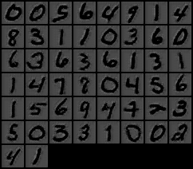
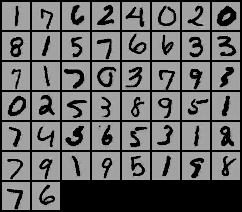
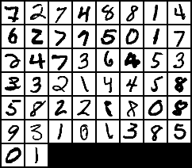

# MNIST Invert Color

Inverting the color of MNIST images from black to white and white to black using CycleGAN implemented with PyTorch.

<br>

## Prerequites
* [Python 3.6](https://www.continuum.io/downloads)
* [PyTorch 0.1.12](http://pytorch.org/) (PyTorch is currently available only on Linux and OSX)
* The code has been written on Linux (ubuntu 16.04 LTS) system 

<br>

## How to

#### 1. Install Python and PyTorch (from the link above or on your own way)

#### 2. Run the command below on Terminal

```bash
$ python CycleGAN_MNIST_Invert.py
```
<br>

## Results

#### 1) Black Background -> White Background
Number of Iteration          |  Original Image            |  Generated (Inverted) Image
:-------------------------:|:-------------------------:|:-------------------------:
0            |    |  
15            |    |  
300            |    |  


#### 2) White Background -> Black Background
Number of Iteration            |  Original Image            |  Generated (Inverted) Image
:-------------------------:|:-------------------------:|:-------------------------:
0            |    |  
15            |    |  
300            |    |  